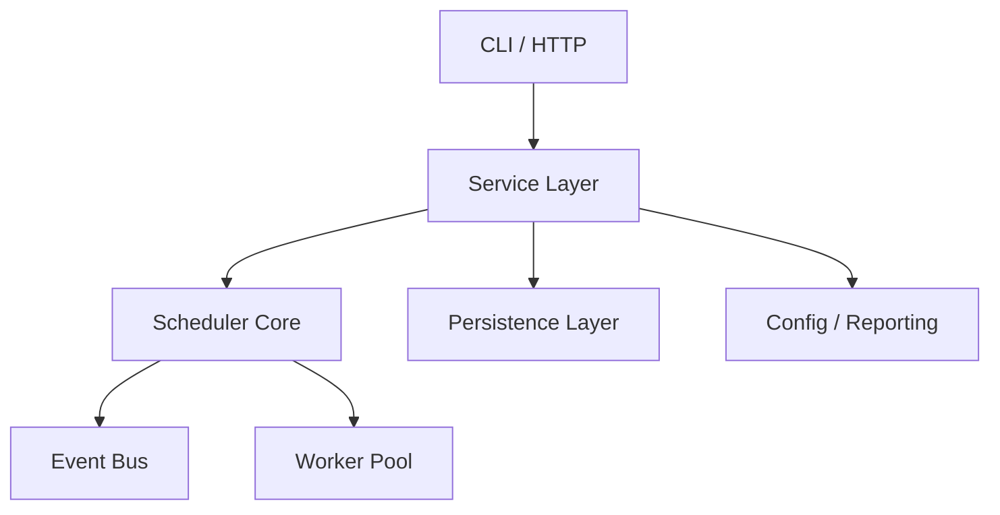

# Architecture

TaskFlow follows a layered architecture:

## Threading Model

- One scheduler-facing path validates workflows and computes topological execution levels.
- Bounded worker threads execute user jobs.
- A single event dispatcher drains a blocking queue so slow listeners do not block job execution.
- Per-job `ReentrantLock` instances implement overlap policies without serializing unrelated jobs.

## Persistence

The service layer depends on repository interfaces, not JDBC classes. JDBC implementations use prepared statements and transaction boundaries, keeping SQL concerns out of scheduler and CLI code.

## Design Patterns

- Strategy: `RetryPolicy` and `JobPriorityStrategy`.
- Observer: `EventBus` and `EventListener`.
- Builder: `Workflow.Builder` and `JobRun.Builder`.
- Repository: `JobRunRepository` and `WorkflowRepository`.
- Template Method: `AbstractEventListener`.
- Singleton-style composition root: `AppContext`.

## Known Trade-Offs

TaskFlow is single-JVM by design. It provides at-least-once style execution semantics and documents idempotency as a job contract rather than promising exactly-once execution.
