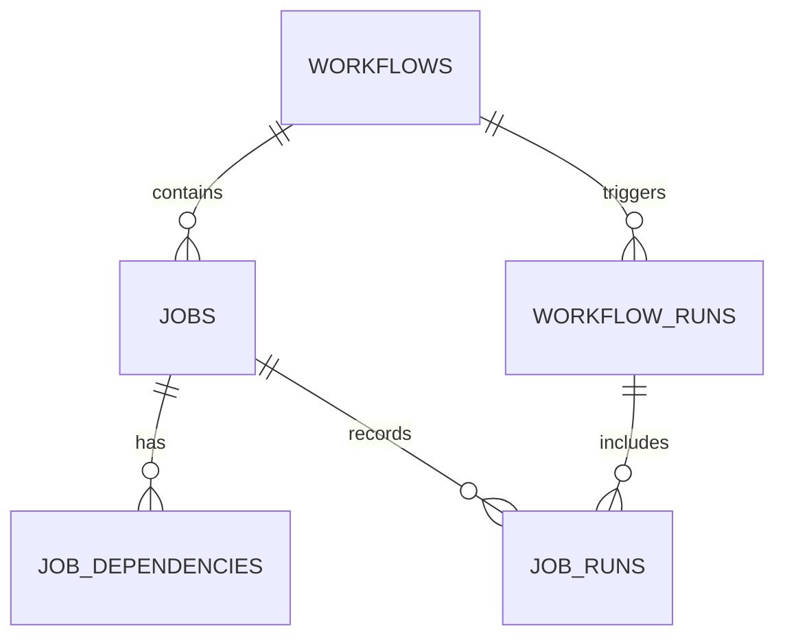

# Entity Relationship Diagram

```mermaid
erDiagram
    WORKFLOWS ||--o{ JOBS : contains
    JOBS ||--o{ JOB_DEPENDENCIES : has
    JOBS ||--o{ JOB_RUNS : records
    WORKFLOWS ||--o{ WORKFLOW_RUNS : triggers
    WORKFLOW_RUNS ||--o{ JOB_RUNS : includes
```
