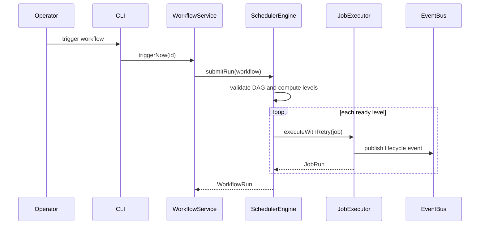
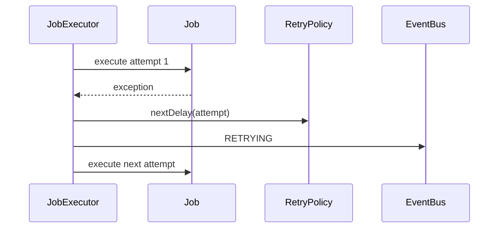

# Sequence Diagrams

## Manual Trigger

```mermaid
sequenceDiagram
    participant Operator
    participant CLI
    participant WorkflowService
    participant SchedulerEngine
    participant JobExecutor
    participant EventBus

    Operator->>CLI: trigger workflow
    CLI->>WorkflowService: triggerNow(id)
    WorkflowService->>SchedulerEngine: submitRun(workflow)
    SchedulerEngine->>SchedulerEngine: validate DAG and compute levels
    loop each ready level
        SchedulerEngine->>JobExecutor: executeWithRetry(job)
        JobExecutor->>EventBus: publish lifecycle event
        JobExecutor-->>SchedulerEngine: JobRun
    end
    SchedulerEngine-->>WorkflowService: WorkflowRun
```

## Retry

```mermaid
sequenceDiagram
    participant JobExecutor
    participant Job
    participant RetryPolicy
    participant EventBus

    JobExecutor->>Job: execute attempt 1
    Job-->>JobExecutor: exception
    JobExecutor->>RetryPolicy: nextDelay(attempt)
    JobExecutor->>EventBus: RETRYING
    JobExecutor->>Job: execute next attempt
```
